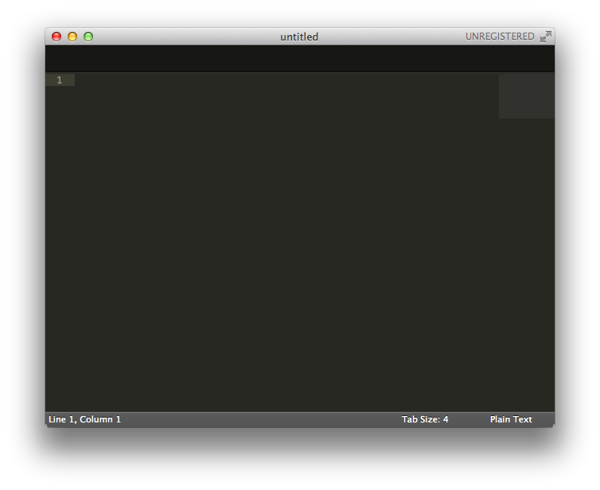
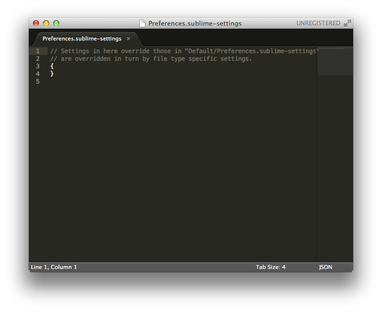
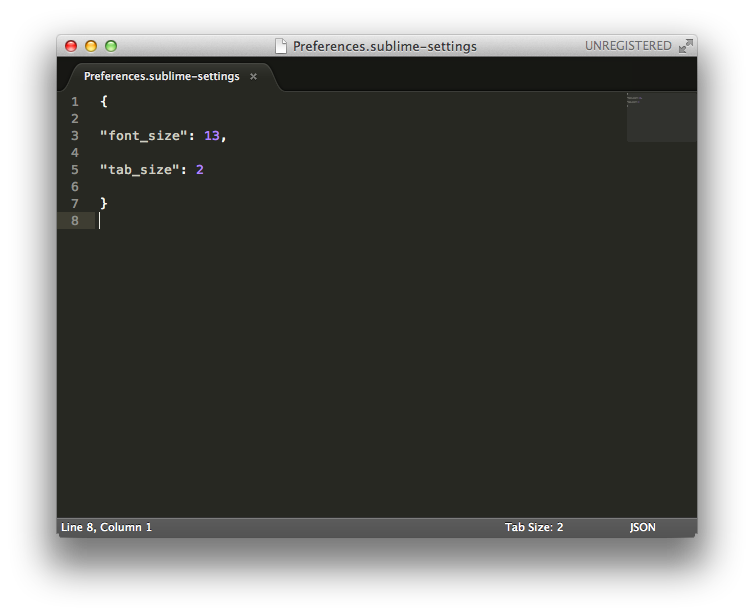

#簡単な計算とテキストエディタの導入
前回は足し算と引き算をやりました。  
掛け算と割り算もやりましょう。
掛け算はこう書きます。  
```
2 * 3
```
結果はもちろん6です。 

続いて割り算はこう書きます。
```
7 / 2
```
結果は3.5と表示されそうですが、3と表示されます。  
整数同士の割り算は小学校でやったような整数の結果になります。

3.5と表示させたいなら、小数の形で書いてあげれば大丈夫です。
```
7.0 / 2.0
```

割った余りを表示させることも可能です。
```
8 % 3
```
8を3で割った余りということで、2が表示されます。  

小数同士でも可能です。
```
7.0 % 2.4
```
ただし、他の数字で入力するとおかしい表示になります。
```
7.3 % 2.4
```
結果はこうなります。
```
0.10000000000000009
```
0.1と表示されて欲しいところですが、何故こうなるのでしょうか？  
コンピュータでは二進数が使われているのは知っていると思いますが、十進数で0.1という数字を二進数に直そうとするとわかります。  
0.00011001100…となって終わりません。  
終わらないので計算をどこかで打ち切らないと、次の計算を始めることができません。  
そのために途中で打ち切ったところで誤差が発生し、それが原因です。  
ただ、整数なら二進数に変換するときに終わらないということがないので、誤差はありません。  
出来る限り整数でできることは整数を使って、細かい結果が欲しい時に小数を使います。

##テキストエディタの導入
本格的にプログラミングをする前にSublime Text 2というテキストエディタを導入します。
###インストール方法
[http://www.sublimetext.com/2](http://www.sublimetext.com/2)からダウンロードします。

- **Windows**  
  お使いのPCのbit数を確認してダウンロードしてください。  
  portable versionではないものを選択し、指示に従ってインストールを行ってください。
  
- **Mac**  
  OS Xと書いてあるところからダウンロードします。  
  ダウンロードが完了したらdmgファイルを開き、Sublime Text 2と書かれたアイコンを、  
  ドラッグアンドドロップで隣にあるアプリケーションフォルダにコピーしてください。   
  その後アプリケーションフォルダから起動しますが、  
  [OS X Mavericks (10.9) / 開発元が未確認のため開けません･･･](http://maverick5.com/os-x-mavericks-10-9-%E9%96%8B%E7%99%BA%E5%85%83%E3%81%8C%E6%9C%AA%E7%A2%BA%E8%AA%8D%E3%81%AE%E3%81%9F%E3%82%81%E9%96%8B%E3%81%91%E3%81%BE%E3%81%9B%E3%82%93%EF%BD%A5%EF%BD%A5%EF%BD%A5-3686.html)  
  などを参考に開ける状態にしてください。  


  
このように起動できたらメニュー上部のPreferences(MacはSublime Text 2からPreferences)をクリックし、  
次に「Settings - User」をクリックします。
 
  
中身を以下のコードを貼り付けて書き換えて保存します。  
```javascript
{

"font_size": 13,

"tab_size": 2

}
```
数字はお好みで調整してください。  
保存して以下のようになれば大丈夫です。(右下のTab Size:が2になっていれば保存できています)


##Scalaコードをファイルから実行する
今までは一行一行試していましたが、実際のプログラミングではもちろんそんな少ない行ではやりたいことは実現できません。  
いくつかのコードを組み合わせて実行するために、Scalaコードが書かれたファイルを保存します。  
拡張子は**.scala**です。

試しにSublime Text 2でFileからNew Fileと選んで新しいファイルを作ります。  
以下のコードを貼り付けます。
```
println(1 + 1)
```
Ctrlキー(Macはcommandキー)とSキーを同時に押すと、ファイル名と保存するフォルダを聞かれるので、  
ファイル名は**1.scala**で**デスクトップ**に保存します。
保存すると、1の部分の色が変わったと思いますが、
拡張子を指定して保存するとSublime Text 2がわかりやすく色を塗ってくれたりするようになります。

ここまで来たらコマンドプロンプトやターミナルを開き、scalaを使っていない状態に戻します。
以下のように入力してください。
```
scala> :q
```
これでscalaと入力する前の状態に戻れたと思いますので、以下のコマンドを実行します。
```
cd Desktop
```
これは今開いているフォルダの中にあるデスクトップをさらに開く動作と思っていいです。
(エクスプローラーやFinderで開いているフォルダとは関係なく使っている黒画面のものだけに影響します。)

上記のコマンドを実行できたら、1.scalaファイルを実行します。
```
scala 1.scala
```
想像できるように2と表示されます。

今回はここまでです。次回からはもう少しプログラミングらしい部分に入っていきます。  
Sublime Text 2ですが、シェアウェアなのでたまに「買ってください！」という感じの表示が出ると思います。  
開発者のためにも、お金に余裕できたらでいいので購入するようにしましょう。

何かあれば[こちら](https://github.com/cohalz/Scala-for-Programming-Beginner/issues/new)かTwitter([@cohalz](https://twitter.com/cohalz))まで気軽にどうぞ。是非一緒に学びましょう。

次回 -> [変数とコードの変更](https://github.com/cohalz/Scala-for-Programming-Beginner/tree/master/02)

前回 -> [Scalaで始めるプログラミング入門](https://github.com/cohalz/Scala-for-Programming-Beginner) 
